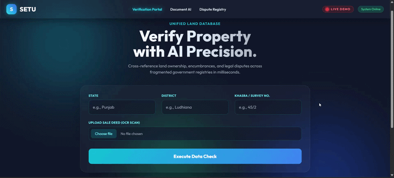

<div align="center">
  
<!-- LIVE TYPING TEXT EFFECT -->
[](https://git.io/typing-svg)

**Smart India Hackathon (SIH) | Team Code Seekers**

[](https://bhavyagupta27.github.io/SETU/)
[](#)
[](https://github.com/bhavyagupta27)

*Fragmented data breeds fraud. 🌉 Setu bridges the gap.*

</div>

---

## 🔴 LIVE SYSTEM DEMO 

<div align="center">
  
  
  
</div>

---

## 📖 The Vision
Land ownership, encumbrances, and legal dispute information are currently scattered across multiple, disconnected government databases. This fragmentation makes property verification a time-consuming, opaque, and fraud-prone process. 

**🌉 Setu** is a unified, multilingual land verification portal. By leveraging AI and OCR technology, we bridge the gap between physical sale deeds and authoritative digital registries, providing a seamless, secure, and transparent verification experience for citizens and authorities.

---

## 🚀 Repository Status: UI/UX Prototype Sprint
> **Note to Judges:** This repository currently hosts our **high-fidelity interactive frontend prototype**. Due to accelerated presentation timelines, this build simulates the core user journey, data flow, and risk-assessment logic. Our immediate next sprint integrates this UI with our planned microservice backend architecture.

---

## 🏗️ The Tech Stack (Proposed Architecture)

Our production-ready architecture separates concerns into highly scalable microservices:

### 🎨 Frontend UI


-20232A?style=for-the-badge&logo=react&logoColor=61DAFB)

### ⚙️ Core Backend & Database


### 🧠 AI & Geospatial


---

## ✨ Key Features Demonstrated

*   🔍 **Single-Interface Search:** Query properties instantly via State, District, and Khasra/Survey Number.
*   📄 **AI Document Matching:** Upload a physical deed to cross-reference names and area sizes against digital records.
*   🚨 **Automated Risk Scoring:** Generates a real-time confidence score flagging critical mismatches.
*   🏦 **Encumbrance & Dispute Flags:** Instantly displays active mortgages or pending court litigations.
*   🗺️ **Interactive Mapping:** Visualizes the verified land parcel using dark-themed geospatial plotting.

---

## 💻 Run the Prototype Locally

Since this is a client-side simulation hosted on GitHub Pages, no server setup is required to test the core UI logic.

```bash
# 1. Clone the repository
git clone [https://github.com/bhavyagupta27/SETU.git](https://github.com/bhavyagupta27/SETU.git)

# 2. Navigate to the directory
cd SETU

# 3. Open the file
start index.html  # On Windows
open index.html   # On Mac
